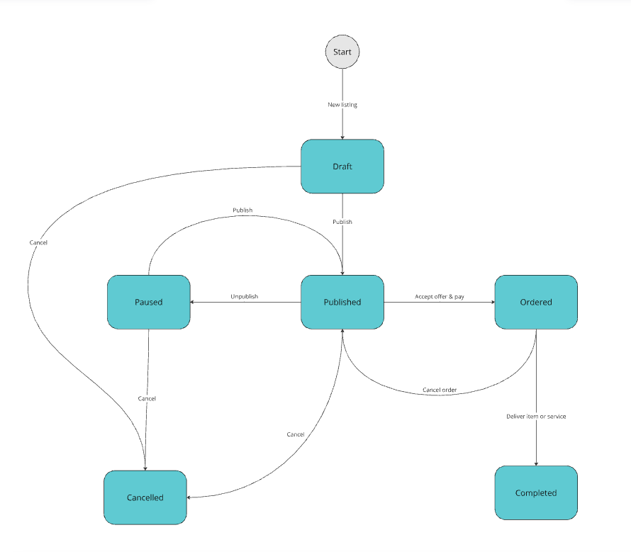

# Metmos Social Technical Overview

## What is Metmos Social?
This platform blends social networking with digital commerce, making it easy to connect, share, and trade online. Leveraging blockchain technologies, cryptocurrency payment and generative AI, we strive to provide a secure, private, and efficient platform for diverse digital interactions. 

[Learn more](https://metmos.io/social-home/)

## Purpose
This page provides a brief description about Metmos Social App tech solutions and designs. If you're interested in learning more about this product or involving in the project, please reach out to us.

## Architecture Diagram

Overview of key infrastructure components


## API Documentation

[Social API](https://metmos-org.github.io/metmos-social-doc/people-api) - Connect, Share, Chat

[Marketplace API](https://metmos-org.github.io/metmos-social-doc/listing-api) - Listing, Offer, Payment

## Tech Stacks and Tools

- Node.js
- Nest.js
- TypeScript
- TypeORM
- React Native
- React Native Paper
- Solidity
- HardHat
- Alchemy
- ethers.js
- Cognito
- API Gateway
- Lambda
- WebSocket
- Amplify
- AWS CDK
- ECS Fargate
- S3
- CloudFront
- Aurora PostgreSQL
- Pinpoint
- Ethereum
- MetaMask
- WalletConnect

## Data Model

Social Domain


Marketplace Domain


## App Screenshots


## Authentication

We leverage Amazon Cognito as our Identity as Service to offload the complexity of implementing a secure and scalable authentication solution. 

We use Amazon Amplify and Amplify UI components (React Native version) to implement the frontend of Sign-up, Sign-in, Sign-out, Reset password and other user authentication relation features. Amplify has built-in integrations with Cognito User Pool so the heavy lifting is handled transparently.


### Sign-up Flow
1. Upon successful user sign-up and account confirmation via email/SMS, **Cognito** will trigger a custom post sign-up Lambda function. This Lambda function will invoke a private endpoint of **PeopleService** to create the **Metmos Social** account.
2. Since all public consumer API endpoints are exposed via **AWS API Gateway**, the **Cognito User Pool** is configured as the authorizer. The **Cognito authorizer** validates the authorization token for all HTTP requests.

### Sign-in Flow
1. Upon successful sign-in via [Authenticator](https://docs.amplify.aws/gen1/javascript/build-a-backend/auth/) | [Amplify UI for React Native](https://ui.docs.amplify.aws/react-native).
2. The current signed-in user is in `AmplifyUser`, which provides a JWT access token.
3. Supply the access token to the `Authorization` header for all backend API calls.
4. **API Gateway** and **Cognito Authorizer** will authenticate the user and grant access to backend services.

## Chat Messaging

This section describes the solution of messaging between people using the platform (e.g. chat messages).


Upon successful sign-in, the app invokes POST /devices  to register the device so the backend keeps track of the known device and associates it to the user. Part of the information is a push token for sending Push Notification to the device. 

Additionally, after each sign-in, the app needs to start a WebSocket connection using the same JWT access token from current user. To send a message to a chat, the app needs to send a message via WebSocket following the predefined format.

As a quick test using `wscat` to connect and send message:
```
wscat -c wss://xxx.execute-api.ap-southeast-2.amazonaws.com/dev/ -H Authorization: ACCESS_TOKEN
>{"action":"sendMessage","data":{"chatUuid":"e0765dcc-43aa-420f-b548-c11a08d5bb0b", "uuid": "d3d29d70-1d25-4913-99b7-5af3159a2c2d", "messageContent":"Hello", "assetUuids":[]}}

From the receiver
< {"chatUuid":"e0765dcc-43aa-420f-b548-c11a08d5bb0b","senderPersonUuId":"0f314731-3069-46d3-87d9-4917712b3542","messageUuid":"d3d29d70-1d25-4913-99b7-5af3159a2c2d","messageContent":"Hello","assetUuids":[]}
```

When the backend receives a new chat message, it will locate all the chat participants and deliver the message to the active web socket connection. If a chat participant is not online (no active web socket connection), the backend will trigger a push notification to the linked device indicating a new message arrived. The app will open the relevant chat screen when the user taps on the notification.

When the user opens the chat screen, GET /chats/{chatUui}/message will be invoked to get all the new messages that haven't been downloaded to the device and store them locally.

Note web socket connection is per app so we will use it as a common channel to deliver real time messages in general, chat messaging is only the first use case.

Step of sending chat messages:
1. User types in a message.
2. After the user presses the Send button, a new message object is saved to the app's local database (e.g. Sqlite) with a uuid v4 generated by the app. Here, it is important for the app to generate a uuid for the new message before sending it to the backend as WebSocket won't return uuid. The app needs the uuid to relate messages downloaded from backend (e.g. chat screen refresh via GET /chats/{chatUuid}/messages). 
3. Send the message via WebSocket.
4. On the receiver end, this message is received via WebSocket, the app will insert it the local database and display it to the chat screen. 

## WebSocket Message Types

Send a text message to a chat:
```
{  
  "action": "sendMessage",
  "data": { 
    "chatUuid": "CHAT_UUID", 
    "uuid": "NEW_MESSAGE_UUID_GENERATED_BY_APP", 
    "messageContent": ".....",
    "assetUuids": [], 
  }
}
```

Create an asset and upload using the asset endpoints with parentUuid set to the current Chat uuid and parentType set to CHAT.

Send assets to a chat:
```
Message sent out via WebSocket
{  
  "action": "sendMessage",
  "data": { 
    "chatUuid": "CHAT_UUID", 
    "uuid": "NEW_MESSAGE_UUID_GENERATED_BY_APP", 
    "assetUuids": ["ASSET_UUID_1", "ASSET_UUID_2", "ASSET_UUID_3"],
    "messageContent": "..." 
  }
}
```

Once the receiver gets a message via WebSocket with assetUuids that is not empty, then invoke GET /assets  with parentUuid=message_uuid to get the asset download links.
```
Message received via WebSocket
{ 
    "senderPersonUuId": "PERSON_UUID",
    "chatUuid": "CHAT_UUID", 
    "messageUuid": "MESSAGE_UUID", 
    "assetUuids": ["ASSET_UUID_1", "ASSET_UUID_2", "ASSET_UUID_3"],
    "messageContent": "..." 
}
```

Outside of WebSocket, whenever the chat screen needs to sync with backend (e.g. when a user opens the chat screen or pull down to refresh), invoke GET /chats/{chatUuid}/messages  and it will return message with assetUuids . If assetUuids  is not empty, it means the message represent assets, then the app should invoke GET /assets  with parentUuid=message_uuid to get the asset download links.

## Payment
This section shows how we capture, secure and distribute crypto currency payment for marketplace offers.

High level payment flow


## Push Notification
We use AWS Amplify and Pinpoint to deliver push notifications. For example, one use case is informing the app that a new message has arrived while the app is either exited or backgrounded (e.g. no active web socket connection). The backend will integrate with Pinpoint to deliver messages via push notification, email or SMS whenever applicable. This is all handled transparently from the app's perspective. The app mainly needs to send the push token to the register device endpoint and be able to respond to the push notifications.

Push Notification List
| NotificationType     | Trigger                                                              | Recipient               |
|----------------------|----------------------------------------------------------------------|-------------------------|
| NEW_CHAT_MESSAGE      | Send a chat message while the recipient is offline (no active WebSocket). | The offline participant |
| OFFER_RECEIVED        | A new offer is made                                                 | Poster                  |
| OFFER_ACCEPTED        | An offer is accepted                                                | Offeror                 |
| PAYMENT_CONFIRMED     | Transfer is confirmed on Escrow account                             | Poster<br>Offeror        |
| LISTING_COMPLETED     | Order is completed and funds transferred to the payee               | Payee<br>Payer           |
| ORDER_CANCELLED       | Order is cancelled and deposit is refunded to the payer             | Payee<br>Payer           |


## Assets
Asset in our system means images, videos, and other type of files in general.
`S3` is our asset repository. All assets stored in our S3 bucket are private. Mobile app will upload assets to a S3 bucket via a securely `signed temporary URL`. 

Mobile app gets a `pre-signed URL` to download the asset from `CloudFront CDN`. CloudFront distribution sources object from S3 and cache them on the global edge locations for fast and scalable delivery to the end users.

`Asset` is a polymorphic entity which can represent user profile photo, experience photos and photos in chat messages.

Example of how to upload a photo as a user profile photo and download it:
1. Create an asset for the photo you're uploading as your profile photo:
```
curl --location 'https://xxx/assets' \
--header 'Authorization: ACCESS_TOKEN' \
--header 'Content-Type: application/json' \
--data '{
  "parentType": "PERSON",
  "parentUuid": "THE_CURRENT_USER_PERSON_UUID",
  "mimeType": "image/jpeg"
}'
```
The response has the S3 pre-signed URL to upload directly from the app to S3 (bypassing our backend):
```
{
    "uuid": "e444ac2c-76d6-4633-abd0-5aba3915d1fc",
    "parentType": "PERSON",
    "s3Key": "814569b1-efe6-4880-9537-b689c3aad9e2/assets/PERSON/e444ac2c-76d6-4633-abd0-5aba3915d1fc",
    "mimeType": "image/jpeg",
    "presignedUploadUrl": "https://infrastructurestack-metmospeoplef65c0838-10e4v4cyzidj0.s3.ap-southeast-2.amazonaws.com/814569b1-efe6-4880-9537-b689c3aad9e2/assets/PERSON/e444ac2c-76d6-4633-abd0-5aba3915d1fc?X-Amz-Algorithm=AWS4-HMAC-SHA256&X-Amz-Content-Sha256=UNSIGNED-PAYLOAD&....",
    "createdAt": "2023-11-01T08:59:09.674Z",
    "updatedAt": "2023-11-01T08:59:09.674Z"
}
```
2. Make a PUT http request with the value from `presignedUploadUrl` as the URL and attach the photo file:
```
curl --location --request PUT 'https://infrastructurestack-metmospeoplef65c0838-10e4v4cyzidj0.s3.ap-southeast-2.amazonaws.com/814569b1-efe6-4880-9537-b689c3aad9e2/assets/PERSON/e444ac2c-76d6-4633-abd0-5aba3915d1fc?X-Amz-Algorithm=AWS4-HMAC-SHA256&X-Amz-Content-Sha256=UNSIGNED-PAYLOAD&....' \
--header 'Content-Type: image/jpeg' \
--data '@/PATH_TO_FILE/random_profile_picture.jpg'
```
3. List the assets of the given `parentType` and `parentUuid`. In this example, we want to get the profile photos, so parentType is `PERSON` and parentUuid is the current user's person.uuid 
```
curl --location 'https://xxx/assets?parentType=PERSON&parentUuid=814569b1-efe6-4880-9537-b689c3aad9e2' \
--header 'Authorization: ACCESS_TOKEN'
```
The response contains a pre-signed CloudFront URL `presignedDownloadUrl` to retrieve the photo (expires in 60 min):
```
{
    "assets": [
        {
            "uuid": "13278812-aa60-4a7e-8064-6bdc0e73bbf2",
            "parentType": "PERSON",
            "s3Key": "814569b1-efe6-4880-9537-b689c3aad9e2/assets/PERSON/13278812-aa60-4a7e-8064-6bdc0e73bbf2",
            "mimeType": "image/jpeg",
            "presignedUploadUrl": "https://infrastructurestack-metmospeoplef65c0838-10e4v4cyzidj0.s3.ap-southeast-2.amazonaws.com/814569b1-efe6-4880-9537-b689c3aad9e2/assets/PERSON/13278812-aa60-4a7e-8064-6bdc0e73bbf2?X-Amz-Algorithm=AWS4-HMAC-SHA256&X-Amz-Content-Sha256=UNSIGNED-PAYLOAD&.....",
            "presignedDownloadUrlExpiration": "2023-11-01T11:25:21.865Z",
            "createdAt": "2023-11-01T10:24:45.524Z",
            "updatedAt": "2023-11-01T10:25:21.964Z"
        }
    ]
}
```

## Listing

Listing lifecycle


Offer lifecycle


How to determine the Payer and Payee on an offer?
|                | ITEM_SALE | SERVICE_SALE | ITEM_PURCHASE | SERVICE_PURCHASE |
|----------------|-----------|--------------|---------------|------------------|
| Payer          | Offeror   | Offeror      | Poster        | Poster           |
| Payee          | Poster    | Poster       | Offeror       | Offeror          |
